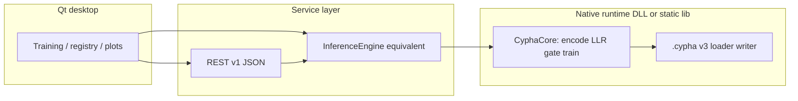

# Full native stack ? replacement plan (Python reference ? C++ / CUDA / Qt)

This document turns **?replace the full Python stack?** into ordered work, frozen interfaces, and acceptance tests.

**Status:** Production runtime ? train, infer, bench, tune, diagnostics, REST, Qt ? runs in **native C++** (`native/`). Quick start: [`docs/native/NATIVE_QUICKSTART.md`](../native/NATIVE_QUICKSTART.md). Master tracker: [`docs/native/CYPHA_FULL_CPP_FRAMEWORK_PLAN.md`](../native/CYPHA_FULL_CPP_FRAMEWORK_PLAN.md).

**Prerequisites:** read [`PORT_CONTRACT.md`](PORT_CONTRACT.md) (inference + `.cypha` v3 + REST shapes + bench ?6) and [`ROADMAP.md`](../verify/ROADMAP.md) (phases 0?4).

---

## 1. What ?full stack? means here

| Layer (former Python) | Native target (production) | Status |
|------------------------|----------------------------|------------|
| **`cypha_core` (legacy)** ? `CyphaDIF`, regressors, encoders, GH, NIG, generation, `train_step`, save/load | **`cypha_core`** + parity CTests | ? **Decommissioned** ? native authoritative |
| **`cypha_accel/`** | **`cypha::accel`** (CUDA / parallel CPU) | ? **`score_batch_parity`**, **`cuda_smoke`** |
| **Studio dataset / trainer / registry** | **`csv_ingest`**, **`preprocessor_*`**, **`dif_train_classify_sequence`**, **`registry_register`**, Qt shell | ? Native CSV + preprocessor + bulk train |
| **Studio REST / GUI** | **`cypha_rest`**, **`cypha_qt_shell`** | ? JSON per **PORT_CONTRACT** ?3; Qt replaces PySide6 |
| **`bench/` (legacy Python package)** | **`cypha_bench_run`**, **`cypha_bench_report`** | ? d01?d17 + cross-domain + figures |
| **Bench tuning** | **`cypha_tune_run`** | ? Sweep JSON ? per-cell native bench |
| **`cypha_diagnostics/`** | **`cypha_diagnostics_run`** | ? Phases 1?4 parity orchestration |
| **CyphaLM (legacy)** | **`cypha_lm_native`**, **`cyphalm_bench_native`**, REST **`/lm/*`**, **`/generate`** | ? Native inference + bench |

---

## 2. Architecture after replacement

**Rule:** one **authoritative** native implementation of `CyphaDIF` / regression heads; GUI and REST are clients. Avoid duplicating math in the UI process unless profiling proves you need a second optimized path.

---

## 3. Milestones (sign-off order)

Each milestone has **exit criteria** you can run without Python in the hot path (fixtures may still be generated by Python offline).

### M1 ? Inference kernel (classification, VectorEncoder)

- [x] Load **`.cypha` v3** ? internal buffers (endianness, tensors per `PORT_CONTRACT` ?1).
- [x] `batch_encode` (VectorEncoder GEMM) + `score_matrix` + softmax + GH gate + confidence (?2) ? **`cypha_parity`** vs `fixtures/`; CTest **`native_parity`**.
- [x] Match **`fixtures/expected.npz`** within agreed tolerances (CTest **native_parity**).
- [x] Optional: `batch_infer_full` parity subset ? CTest **native_parity** (v2 tail); native **`cypha_parity`** v2 tail (entropy + confidence vs softmax?gate).
- [x] **Tier-1:** native **`CyphaInferModel::from_root`** restores **`ctx_hist_packed`** / **`ctx_cooccur`** / **`ctx_last_label`** from **`.cypha`** (Python **`save_state`**). **`reference.cypha`** keeps Tier-1; **CTest **native_***** checks it.

**Python off path:** run a small native test harness that reads `reference.cypha` + `expected.npz`.

**Native tree (CPU):** `native/` ? M1 **`cypha_parity`**, M2 **`preprocessor_parity`** + **`preprocessor_fit_parity`** + **`csv_ingest_parity`** + `registry_scan`, M3 **`memory_train_parity`** + **`memory_train_roundtrip`** (`.cypha` save slice), M5 **`cypha_rest`** prototype. Optional **`cypha::accel`** CUDA + **`cuda_smoke`**. `F_field` still via sidecar / `f_field.json` until a future `.cypha` revision stores it.

### M2 ? Registry + preprocessor contract

- [x] Read **`model.cypha`** + **`preprocessor.json`** + **`card.json`** layout (`registry_scan` + docs). **Write:** native **`registry_register`** / **`registry_register_bundle`** copies pre-built artifacts into the same directory layout (CTest **`native_registry_register`**).
- [x] **`preprocessor.json`** ? JSON Schema [`schemas/preprocessor.schema.json`](schemas/preprocessor.schema.json); native `transform_one` checked by **`preprocessor_parity`** + `fixtures/preprocessor/`; CTest **`native_preprocessor`**. Native **`fit_from_design_matrix`** (scale on/off + PCA + RFF) vs Python **`fit`**: CTest **`native_preprocessor_fit`**, **`fixtures/preprocessor_fit/`** + **`preprocessor_fit_no_scale/`** + **`preprocessor_fit_rff/`**.
- [x] **CSV dense load (Studio `CSVDataset` subset):** **`cypha::load_csv_dense`** + **`parse_csv_utf8`** (Excel dialect) vs **`CSVDataset.from_file`** ? **`cases.json`** may supply **`target_col_name`** / **`feature_col_names`** (header lookup, first match per name) or **`target_col_index`** / **`feature_col_indices`** (negative indices count from end, matching Python); **`fixture_schema` 3** adds a **multiline quoted field** (newline inside quotes). Generator self-checks **`read_chunk_rows`** vs full load for numeric fixtures. CTest **`native_csv_ingest`**, **`fixtures/csv_ingest/`**. **`preprocess_train_classify_parity`** **`csv_spec`** accepts the same optional name fields.

### M3 ? Online training (`train_step`) ? CyphaDIF

- [x] **Core memory step:** `DIFMemory.train` + `WorldPrior.update` parity ? `memory_train_parity` + `fixtures/memory_train/` (loss + world + class tensors); CTest **`native_memory_train`**.
- [x] **Native `.cypha` write (memory slice):** **`save_cypha_file`** / **`save_cypha_to_buffer`** + **`load_cypha_from_buffer`** + **`CyphaDifMemoryState::merge_state_into_root_for_save`** ? CTest **`native_memory_train_roundtrip`** (subprocess + **`cypha_load_binary`** tree match vs **`after.cypha`**; native tool also checks in-memory save/load equals file round-trip). Full-model **`save_state`** parity beyond `world`/`classes`/`F_field` still grows with remaining port slices.
- [x] **VectorEncoder `train_step` slice (CPU):** `dif_train_step_vector` + **`dif_gh_train_step_vector`** (GH scales world/delta/**enc** LRs; replay uses same scaled LRs as Python `gh_train_step`) ? memory train ? sync ? replay ? misclassification + **deliberate** contrastive ? **`dedup_check`** every 5 steps ? **`encoder_align_to_offsets`** every `align_every` ? **NIGField** when `field_W_T` + **`w_inject`** ? **full `context_prior` / `record`** ? **`llr_scale_ema`** ? **OOD EMA** every 20 steps; **`auto_recalibrate_temperature`** + optional `temp_recalib_every`; **`adapt_temperature_ece`** + REST **`/adapt_temperature`**. **Numeric:** CTest **`native_train_step_vector`** + `fixtures/train_step_vector/sidecar.json`. Context prior for **`memory_train`** includes the **incoming label** when the class is new (matches Python `train_step`). **`cypha_rest`** reads **`align_every`** / **`temp_recalib_every`** from **`train_hparams.json`** (defaults match Python `_ALIGN_EVERY`). Remaining stretch: stricter REST JSON parity vs `test_api_contract` on every optional field.
- [x] **Multi-step quantile-style train replay:** **`fixtures/quantile_dif_train/`** ? **`replay_ratio = 0`** (no priority replay; buffer may exceed 10), **`enc_lr = 0`**, then **`batch_llr_from_x`**; CTest **`native_quantile_dif_train`**. **`fixtures/dif_train_replay/`** ? **`replay_ratio > 0`** with sidecar **`replay_u01`** (recorded gate + sample uniforms; NumPy **`MT19937(seed)`** ? **`std::mt19937(seed)`**); CTest **`native_dif_train_replay`**. **`TrainStepExtras`** + **`ReplayBuffer::sample`** accept optional fixed U(0,1) stream for REST-free parity. **`CyphaDIF`**: **`replay_ratio`**, separate **`replay_rng`** (defaults to **`rng`**), replay gate uses **`replay_rng.random()`** (not global **`np.random`**). **`replay_ratio ? 0`** skips replay draws (matches native).
- [x] **Python-off classification training loop (Studio-shaped):** native **`dif_train_classify_sequence`** chains **`dif_train_step_vector`** for an ordered step list. **`fixtures/studio_trainer_classify_hotpath/`** mirrors **`Trainer.fit`** epoch **`permutation`** order with **`enc_lr > 0`**, **`replay_u01`**; CTest **`native_studio_trainer_classify_hotpath`** (same binary as quantile replay). **`fixtures/studio_trainer_gh_classify_hotpath/`** mirrors **`Trainer.fit`** + **`gh_train_step`** with threaded **`chi`** / **`psi`** via **`dif_gh_train_classify_sequence`**; CTest **`native_studio_trainer_gh_classify_hotpath`**. **`fixtures/studio_trainer_preprocess_classify_hotpath/`** ? **`Preprocessor.fit`/`transform_one`** then **`train_step`** on each row (native **`preprocess_train_classify_parity`**); CTest **`native_studio_trainer_preprocess_classify_hotpath`**. **`fixtures/studio_trainer_preprocess_gh_classify_hotpath/`** ? same GH goldens as **`studio_trainer_gh_classify_hotpath/`** through **`preprocess_train_classify_parity`** (identity **`Preprocessor`**, **`x_raw`** steps); CTest **`native_studio_trainer_preprocess_gh_classify_hotpath`**. Chunked CSV streaming remains future work; **`native_csv_ingest`** covers **dense** parse + float **`X`** + targets with **header name** or **index** column selection.
- [x] **CSV + preprocessor classify train:** **`fixtures/csv_preprocess_classify_hotpath/`** ? same numeric goldens as **`studio_trainer_preprocess_classify_hotpath/`**, but **`preprocess_train_classify_parity`** loads rows from **`train.csv`** via **`cypha::load_csv_dense`** (**`csv_spec`**); CTest **`native_csv_preprocess_classify_hotpath`**.
- [x] GH training path (`gh_protect` / `use_gh`): native mirrors Python `gh_train_step` LR scaling + session ? adaptation.
- [x] **`nig_adapt_session_chi`** vs Python **`_nig_adapt`** (3 fixed rows): CTest **`native_nig_adapt`**.

### M4 ? Regression stack

- [x] **Scalar mixture (`predict_mixture_scalar`, d=1):** CTest **`native_regression_mixture`**.
- [x] **`DIFRegressor`** ? Python **`save_state` / `load_state`** (expert ? / var EMAs + `clf_state`); **`ModelRegistry`** with **`model_type: "DIFRegressor"`** + matching **`field_dim`** on **`ModelCard`**. Native **`predict_mixture_batch`** + **`expert_target_ema_step`** (`regression_stub.cpp`); CTest **`native_regression_m4`** + **`fixtures/regression_m4/sidecar.json`** (batch/EMA plus RLS + two-stage blocks below); CTest **`native_regression_mixture`**, registry round-trip (CTest **`native_registry_register`**). **Online train + predict slice:** CTest **`native_dif_regressor_train_step`**, **`fixtures/dif_regressor_train_step/`** ? **`dif_train_step_vector`** + **`expert_target_ema_step`** + scalar **`predict_mixture_scalar`** vs Python **`DIFRegressor.train_step`** / **`predict`** (cold hash then **`score_matrix`** LLR argmax = **`infer()`** expert; **`replay_ratio>0`** with sidecar **`replay_u01`** + **`TrainStepExtras`**; **`DIFRegressor`** forwards **`replay_ratio`** / **`replay_rng`** into **`CyphaDIF`**); 12 steps; **`scripts/generate_dif_regressor_train_step_fixture.py`**. **Python registry:** **`RFFRegressor`**, **`TwoStageDIFRegressor`**, **`MKERegressor`** round-trip via **`ModelRegistry`** + **`MKERegressor` `enc_W`/`enc_b`** in **`save_state`** (RFF routing features are not in **`CyphaDIF` `clf_state`**).
- [x] **Native RFF / MKE / two-stage kernels:** `rff_encode_batch_rowmajor`, ridge-with-bias fit/predict, `mke_expert_linear_dots` ? CTest **`native_regression_rff`**, `fixtures/rff_regression/`.
- [x] **Native RLS + two-stage predict combine:** `rff_rls_train_step` (bias-augmented, matches **`RFFRegressor.train_step`**), `mke_expert_rls_scalar_step` (per-expert RLS + optional forgetting, matches scalar **`MKERegressor.train_step`** inner loop), `two_stage_dif_predict` (precomputed LLR + **X** + stage-2 ?, matches **`TwoStageDIFRegressor.predict`** scaling). Validated in **`native_regression_m4`** / **`fixtures/regression_m4/sidecar.json`** (`rff_rls`, `mke_rls`, `two_stage`).
- [x] **Milestone 5 ? `MKERegressor` routing + native-LLR two-stage pipeline:** `router_softmax_from_llr`, `mke_routing_entropy`, `mke_scalar_predict_from_llr` (softmax + weighted expert mean + entropy, matches **`MKERegressor.predict`** scalar path); `mke_route` vectors in the same **`regression_m4`** sidecar. **`two_stage_dif_predict_with_clf`** composes **`batch_encode`** + **`score_matrix_use_field`** + stage-2 RFF + combine ? CTest **`native_regression_two_stage_pipeline`**, **`fixtures/two_stage_pipeline/`**. **One full scalar `MKERegressor.train_step` slice** (RFF ?, **`score_matrix(?)`** routing per Python **`_route`**, GH-scaled expert RLS, **`dif_train_step_vector`** on ? with **`enc_lr=0`**, **`replay_ratio=0`**) ? CTest **`native_mke_train_step`**, **`fixtures/mke_train_step/`**. **Multi-step** same tool + sidecar **`steps`**, **`replay_warmup`**, **`replay_u01`** (**`enc_lr>0`**, **`replay_ratio>0`**) ? CTest **`native_mke_train_extended`**, **`fixtures/mke_train_extended/`**. *(Per-step world log-normalizer matches Python **`load_state`** / disk path via **`refresh_world_log_norm_from_v`** in the native harness.)*
- [x] **Milestone 6 ? two-stage ridge fit from LLR:** **`two_stage_dif_ridge_fit_from_llr`** matches **`TwoStageDIFRegressor.fit`** linear algebra once **LLR** (**N?K**) is known (stage-1 **[LLR|X|1]** ridge with **???N** on all coeffs; stage-2 RFF ridge on residuals with **???N** on all coeffs). CTest **`native_regression_two_stage_ridge_fit`**, **`fixtures/two_stage_ridge_fit/`**. *(LLR in sidecar is frozen; native proves ridge stages match.)*
- [x] **Milestone 7 ? batched two-stage predict + batch LLR API:** **`two_stage_dif_predict_batch`**; **`cypha::batch_llr_from_x`** (`batch_encode` + **`score_matrix_use_field`**) with CTest **`native_batch_llr`**, **`fixtures/batch_llr/`**.
- [x] **E2E ridge parity on router LLR:** **`fixtures/two_stage_e2e_ridge/`** ? frozen router **LLR** in sidecar; CTest **`native_regression_two_stage_e2e_ridge`** reuses **`regression_two_stage_ridge_fit_parity`**.

### M4b ? Trainer regression (native)

- [x] **`Trainer.fit`** covers **`RFFRegressor`**, **`TwoStageDIFRegressor`**, **`MKERegressor`** on a sklearn regression set ? CTest **native_regression_***. **`_build_model`** no longer returns the **`MKERegressor`** class for **`MKE`** (placeholder **`None`** until **`_fit_mke`** builds the model).

### M5 ? REST + Qt shell

- [x] **`cypha_rest`:** `/health`, `/ready`, `/metrics`, `/predict`, `/update` (memory train + resync infer buffers), **`/adapt_temperature`**, `/session`, `DELETE /session`, `/classes`, `/models`, `/load`, **`/register`** (bundle copy into `--registry` tree; mirrors CLI **`registry_register`**). Optional **`--regression-json`** / `regression_head.json` ? `/predict` **`regression_val`** / **`uncertainty`** (scalar MoE; `predict_mixture_scalar`). FastAPI **`/adapt_temperature`** matches (Pydantic schemas + `CyphaDIF.adapt_temperature`); **`POST /register`** copies bundles when a **`ModelRegistry`** is attached (**`503`** if none ? same body shape as native).
- [x] **FastAPI regression sidecar:** **`CYPHA_REGRESSION_HEAD`**, **`create_app(..., regression_head_path=...)`**, headless **`--regression-head`** ? same MoE math as native; REST smoke with **`CYPHA_REST_BIN`**.
- [x] REST shape parity (incremental): **`POST /update`** body ? **`{ loss, n_corrections }`** only (`test_api_contract` + `test_cypha_rest_smoke`); **`POST /load`** success ? **`loaded`** with full **`ModelCard`** keys (`test_post_load_success_returns_full_modelcard_keys`). Native: GH scales **world / delta / enc** when `use_gh`; **session ?** (`nig_adapt_session_chi`); **`train_hparams.json`** includes **`align_every`**, **`enc_lr`**, **`replay_ratio`**, **`replay_cap`**, **`temp_recalib_every`**. **`/predict`** with **`return_explanation`**: native vs FastAPI **key trees** checked in **`test_cypha_rest_fastapi_json_shape_parity`**; nested numeric parity for future **`explain()`**-only leaves is optional (**`PORT_CONTRACT.md`** ?3).
- [x] Qt: full Studio parity (dataset ? train ? register ? charts). **`cypha_qt_shell`** ? **Dataset panel** (column picker combo + feature checklist + raw CSV preview table + val split % hold-out with post-train accuracy eval); **Fit preprocessor dialog** (scale + PCA from `fit_from_design_matrix`, save `preprocessor.json`); CSV + REST/native bulk train; loss plot (REST vs native overlaid + optional EMA; painted or **`-DCYPHA_QT_CHARTS=ON`**) + **PNG / SVG / CSV** export; **`POST /predict`** optional **`return_explanation`**; **save `.cypha`** (merge + infer patch incl. context, **`mid_trans`**, **`field_W_T`**, **`field_a_eff`**, **`field_step`**, **`feat_dim`**, **`total_correct`**, **`ll_world_ema`**, **`ood_sigma`**, GH session keys); **train hparams** UI + auto `train_hparams.json`; **`replay_u01`**; MKE regressor loop + `regression_y` bulk; training progress panel (per-class accuracy bar + rolling stats); batch predict; registry + **`POST /load`**; **`GET /ready`**; **`QProcess`** `cypha_rest`; Experiments (M6) panel (open `.db`, start/finish runs, list runs table); CTest **`native_qt_shell_smoke`**. **`cypha_qt_stub`**: `load_cypha_from_buffer`. CI: **`qt6-base-dev`** (Charts off unless **`-DCYPHA_QT_CHARTS=ON`**). **Next:** streaming training thread (move bulk to `QThread`); chart zoom/pan; packaged AppImage ? see **[`docs/FUTURE.md`](../FUTURE.md) ?2?3**.

### M6 ? Experiments DB (optional)

- [x] Schema documented: [`EXPERIMENTS_SCHEMA.md`](EXPERIMENTS_SCHEMA.md) (DDL mirror of native **experiment_db_crud**).
- [x] **`native/experiment_schema.sql`** (CMake-generated) ? DDL for **experiment_db_smoke**.
- [x] Optional native **DDL + FK smoke:** **`experiment_db_smoke`** + CTests **`native_experiment_db_smoke`** / **`native_experiment_db_file`** (SQLite3; CMake-generated DDL) (DDL from **`tests/experiment_schema_ddl.py`**).
- [x] Native SQLite **ExperimentDB-equivalent API** from C++ ? **`experiment_db_crud`** (`native/include/cypha/experiment_db_crud.hpp`): insert/finish, append **`metrics_history`**, **`fail_run`**, delete run/experiment, get/list rows, **`update_run_status`** / **`update_run_notes`**, **`best_done_run`** / **`leaderboard`**, **`compare_runs`** ? plus **`experiment_db_crud_parity`** / CTest **`native_experiment_db_crud`**. **M6 smoke:** native **`experiment_db_smoke`** exercises DDL + DML + metric **`UPDATE`** + file reopen; *(Optional follow-up: full dynamic Python **`update_run`** parity; contract drift guard: CTest **native_experiment_schema** vs [`EXPERIMENTS_SCHEMA.md`](EXPERIMENTS_SCHEMA.md).)*

---

## 4. On-disk artifacts to freeze

| Artifact | Spec source |
|----------|-------------|
| **`model.cypha`** | `PORT_CONTRACT.md` ?1, `cypha_save_binary` / `cypha_load_binary` / **`cypha_save_binary_to_bytes`** / **`cypha_load_binary_from_bytes`** (native **`save_cypha_to_buffer`** / **`load_cypha_from_buffer`**) |
| **`preprocessor.json`** | **PREPROCESSOR_CONTRACT.md** + JSON Schema [`schemas/preprocessor.schema.json`](schemas/preprocessor.schema.json) |
| **`card.json`** | **PORT_CONTRACT.md** ?3 / registry layout |
| **Experiments** | **EXPERIMENTS_SCHEMA.md** (native **experiment_db_crud**) |

---

## 5. Native ?surface API? sketch (for engineering)

Implement as a **C API** or **C++ class** with stable ABI; Qt/REST wrap it.

**Inference**

- `load_cypha(path)` / `unload`
- `encode_batch(raw_ptr, n, d_in, out_h)`  
- `score_matrix(h, n, d, use_field, out_llr, labels_out)`  
- `infer_batch` ? labels + confidences (+ optional full rows)

**Training**

- `train_step(x, label)` / `train_step_regression(x, y)`
- `save_cypha(path)`

**Session / metrics** (for REST parity)

- Counters: predictions, corrections, OOD flags (mirror `InferenceSession` summaries).

Exact signatures are internal; **JSON REST** remains the external integration contract for tools.

---

## 6. Test strategy (full stack)

| Test type | Owner | Purpose |
|-----------|--------|---------|
| **Parity npz** | Native CI | Inference vs `expected.npz` |
| **Training parity** | Native CI | After M3: fixed seed schedule vs Python-exported `.cypha` |
| **REST contract** | Native CTest + REST smoke | Same payloads as **PORT_CONTRACT.md** ?3 + REST smoke |
| **Registry round-trip** | Native | Register ? load ? predict matches |
| **End-to-end** | Manual / UI automation | Qt flows |

Keep **fixtures/** aligned with native math when the frozen contract changes ? see **MAINTENANCE.md**.

---

## 7. Native cutover sequence (Python out of the hot path ? **achieved v2.2**)

**Done for production:** milestones M1?M7, native bench/tune/diagnostics, and parity fixtures mean **one native core** (`cypha_core` + `cypha_lm_native`) owns **encode ? LLR ? gate ? train ? I/O ? bench**, with Qt/REST as thin clients. Python is **prototyping-only** ? golden math reference and **offline** fixture generation, not the shipped runtime.

**Already aligned with ?all native? (hot-path math in C++, CI-gated):**

| Block | Role |
|-------|------|
| **M1?M3** | Load `.cypha`, infer, `dif_train_step_vector` / **`dif_train_classify_sequence`** / **`dif_gh_train_classify_sequence`** / replay / NIG / context ? **`ctest`** + sidecars |
| **M4?M7** | Regression kernels, MKE RLS + routing slices, two-stage pipeline/ridge/batch LLR ? **`native_regression_*`**, **`native_mke_train_*`**, **`native_batch_llr`**, etc. |
| **`cypha_rest`** | `/predict`, `/update`, `/load`, ? ? JSON frozen in **`PORT_CONTRACT.md`** |

**Still between you and ?everything in native? (typical order):**

| Priority | Work | Exit criterion |
|----------|------|----------------|
| 1 | **Qt (or non-Python) orchestration** | Dataset ? train loop ? registry ? predict in C++/Qt. See **`native/qt/README.md`**. Today: **`cypha_qt_shell`** ? REST + native train, **save `.cypha`** (merge + infer/context/**`mid_trans`**/**`field_W_T`**/**`field_a_eff`**/**`field_step`**/**`ood_sigma`**/GH patch), **hparams** + **`train_hparams.json`**, registry, **`/ready`**, loss plot + EMA + PNG/SVG/CSV export (optional Qt Charts via **`-DCYPHA_QT_CHARTS=ON`**), **`/predict`** **`return_explanation`**, **`cypha_rest`**. **Next:** optional **`save_state`** tails vs Python; richer Studio UX. Qt ? 6.4, **`QT_QPA_PLATFORM=offscreen`** on CI. |
| 2 | **Full online loops without Python** | **Classification:** **`dif_train_classify_sequence`** + studio hotpath CTests; **`preprocess_train_classify_parity`** + **`native_studio_trainer_preprocess_classify_hotpath`** / **`native_studio_trainer_preprocess_gh_classify_hotpath`** / **`native_csv_preprocess_classify_hotpath`** (**`preprocessor.json`** + raw **`x_raw`** or **`train.csv`** + **`csv_spec`** ? **`transform_one`** ? train or GH train). **`native_preprocessor_fit`**, **`native_csv_ingest`**, **`dif_gh_train_classify_sequence`**. **Regression:** **`native_dif_regressor_train_step`** (**`DIFRegressor`** cold + warm **`infer()`**-equivalent routing + MoE **`predict`** + **`replay_u01`** when **`replay_ratio>0`**); **`MKERegressor`** stretches partly Python-led beyond parity slices. **`mke_scalar_train_step`**, **`cypha_rest`** **`regression_y`**. |
| 3 | **Registry / card write path in native** | **`registry_register`** CLI + **`cypha::registry_register_bundle`** copy a pre-built **`model.cypha`** + **`card.json`** (+ optional **`preprocessor.json`**) into `<root>/<name>/<version>/` (CTest **`native_registry_register`**). Full ?train then save? in native remains future work. |
| 4 | **Deterministic replay in REST** | Native **`cypha_rest`** already accepts optional **`replay_u01`** on **`POST /update`** for classification and MKE (see **`PORT_CONTRACT.md`** ?3). Optional follow-ups: export / fix the session RNG for clients that do not send **`replay_u01`**; FastAPI **`501`** path if you need identical JSON shapes without native. |
| 5 | **Experiments DB beyond smoke** | **`cypha::ExperimentDb`** + **`experiment_db_crud`** (insert/finish, append metrics, fail/delete, get/list, best/leaderboard, **`compare_runs`**, partial **`update_run`**); **`experiment_db_crud_parity`**, CTest **`native_experiment_db_crud`**. Full dynamic Python **`update_run`** still optional. |

**Rule of thumb:** each row above should gain a **CTest or native binary + fixture** (or Qt smoke) before you delete the Python twin from the product path.

---

## 8. Risk register (planning)

1. **Numerical drift** ? fp32 vs fp64; fix rules per layer (inference fp64 until proven safe).
2. **RFF + Ridge** ? heavy linear algebra; share one LAPACK/CUDA solver path.
3. **Threading** ? Python uses locks around memory; native must document thread-safety of `train_step` vs `infer`.
4. **Generation / sampling** ? large surface; defer past M5 unless product-critical.
5. **CuPy paths** ? reference only; native CUDA / CPU accel replaces them.

---

## 9. Doc index (keep in sync)

| Update when? |
|----------------|
| Bump `.cypha` version ? `PORT_CONTRACT.md` |
| Change REST fields ? `PORT_CONTRACT.md` ?3 + **PORT_CONTRACT.md** ?3 + REST smoke |
| Change registry layout ? this file ?4 + **PORT_CONTRACT.md** ?3 |
| Add training golden ? new native parity tool + CTest **native_*** hook |
| Plan ?Python off hot path? ? **?7** (achieved); quick start ? [`NATIVE_QUICKSTART.md`](../native/NATIVE_QUICKSTART.md) |
| Native bench/tune contract ? [`PORT_CONTRACT.md`](PORT_CONTRACT.md) ?6 |

---

**All milestones M1?M7 complete (v2.2 release readiness).** The native hot path covers encode ? LLR ? gate ? train ? I/O ? REST (CyphaDIF + CyphaLM + Branch A) ? Qt UI ? Experiments DB ? bench/tune/diagnostics. **Python is prototyping-only** ? golden math reference and offline fixture generation.

**Validation gate:** `powershell -File scripts/cypha_native_validate_all.ps1` (or build + `ctest -R native_`). Install: `packaging/install_release_windows.ps1` / `packaging/install_release_linux.sh`.

**Next horizons** ? see **[`docs/FUTURE.md`](../FUTURE.md)**:
- **?1** CUDA tuning (batch thresholds, persistent device buffers) if serving latency matters
- **?2?3** Qt streaming training thread + packaged binary (AppImage / Windows `.exe`)
- **?4?5** Web UI + multi-model `cypha_rest` serving
- **?6** Curriculum / active learning in the training loop
- **?7** ONNX export for inference-only deployments

**Ongoing hygiene:** [`docs/verify/MAINTENANCE.md`](../verify/MAINTENANCE.md) (fixtures, **`ctest`**, experiment DDL, **`CYPHA_REST_BIN`**).
