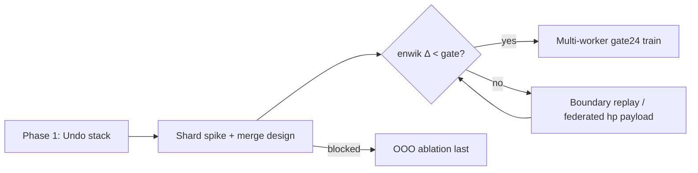

# CyphaLM training scale research — gate24 hp adapt

**Date:** 2026-09-20  
**Branch context:** gate24-only `main`; undo-stack work proceeds separately ([`CYPHALM_LOSSY_LLM_PLAN.md`](CYPHALM_LOSSY_LLM_PLAN.md) Phase 1).  
**Quality bar:** enwik8.8mb observe BPC **1.611729** (vendored gate24, measured 2026-09-19) — see [`CYPHALM_HP_ALGORITHM_PROFILE.md`](CYPHALM_HP_ALGORITHM_PROFILE.md). Do not invent BPC; cite measured values only.

---

## Executive summary

hp online adaptation in CyphaLM is **sequential and causal**: each bit is predicted from state that depends only on prior bits, then state updates on the observed bit. That is why the compress-equivalent metric (`eval_bpc` / `observe_stream_bits`) is a single left-to-right pass, not a batch gradient step.

To scale **training** (table adaptation) without changing the ~1.61 enwik BPC bar:

| Approach | Fits hp? | Quality risk | When |
|----------|----------|--------------|------|
| **Undo stack** (inference latency) | Yes — same causal math | Low | **First** — unblocks `predict_next` / bit-tree DFS at gate24 scale |
| **Shard + merge** (N workers × gate24) | Partial — merge hooks exist for CyphaDIF, **not** for `hp::Predictor` | Medium–high | **Second** — after undo; needs counter export + merge design |
| **Parallel SIMD / multi-job** | Yes — independent corpora or independent hp CLI jobs | Low (per job) | Anytime for throughput; not one-stream data parallel |
| **Out-of-order adaptation** | No — breaks causal equivalence | High | **Last** — gated ablation only if shard merge stalls |

**Recommended order:** undo inference → shard spike → OOO only if needed.

**Spike harness:** `scripts/cyphalm_hp_shard_spike.sh` → `native/tools/cyphalm_hp_shard_spike.cpp`.

---

## 1. Why core hp adapt is sequential / causal

### 1.1 Compressor–decompressor contract

From `hp/predictor.hpp` (upstream CompressionAlgorithm):

> Per bit: experts → mixer → APM → code bit → **everything updates on the observed bit**.  
> Steps 1–3 and 5 are IDENTICAL in compressor and decompressor, and depend only on data both sides already have.

Cypha exposes this through `HpSequenceBackend::observe_next_byte` / `observe_stream_bits` and `CyphaLMModel::eval_bpc_compress_equivalent`:

```
for each byte:
  for bit 7..0:
    p = pred.predict()      // context = all prior bits in stream order
    score observed bit
    pred.update(bit)        // mixer, hedge, APM, counters, match rings, wordstream, …
```

There is **no** backward pass, no shuffled minibatch, and no parameter tensor shared across positions independent of history.

### 1.2 Stateful subsystems (not just counters)

gate24 enables dozens of context models, match models, wiki/wordstream axes, GRIA bucket, and ring buffers sized by `table_bits` / `buf_bits`. All of these advance on `Predictor::update(int y)`:

- **Counters** (`counter_update` in `models.hpp`) — adaptive `{p,n}` tables indexed by context hash.
- **Mixer / hedge weights** — online logistic updates per context slot.
- **Match rings** — literal history for long-range match models; pointer rebind on `clone_from`.
- **Wordstream / wiki parsers** — byte→token boundary state; wrong order corrupts context keys.
- **GRIA** — switch-rate accounting from recent prediction errors.

Reordering bits or bytes changes which contexts fire; the resulting predictor is a **different function** than single-stream training, even if counter tables were magically merged.

### 1.3 Cypha API mapping

| API | Causal? | Updates main `pred_`? | Valid archive BPC? |
|-----|---------|----------------------|-------------------|
| `eval_bpc` / `observe_stream_bits` | Yes | Yes | **Yes** |
| `consume_byte` | Yes | Yes | (training) |
| `next_byte_log_probs` / `log_prob_byte` | Scores only | No (uses `scratch_` / clone) | No |
| `predict_next` (256-way) | Scores only | No | No |

BPC regression gates must use **observe**, not clone-API top-k ([`CYPHALM_BPC_GAP_REPORT.md`](CYPHALM_BPC_GAP_REPORT.md)).

### 1.4 Implication for “data parallel training”

Classic **one-stream data parallel** (split one corpus across GPUs, all-reduce gradients each step) does **not** apply: there are no fixed global weights; the “parameters” are the entire mutable predictor state trajectory.

What *does* work:

- **Multiple independent streams** (different files, shards, or jobs) each with their own `hp::Predictor`, later merged if tables are mergeable.
- **SIMD within a single `update`** (hp already uses xsimd for mixer dots when `CYPHA_HP_XSIMD=ON`).
- **Multiple OS processes** each running `hp c` or Cypha observe on disjoint inputs (embarrassingly parallel throughput).

---

## 2. Sharding + merge (preferred scale path)

### 2.1 Target architecture

```
Corpus C  →  split  →  C₀ … C_{N-1}
                ↓              ↓
         Worker 0 … Worker N-1   (each: fresh gate24 Predictor, consume/observe shard)
                ↓              ↓
            payload₀ … payload_{N-1}   (exported tables + metadata)
                ↓
         Merge coordinator
                ↓
         Merged Predictor  →  eval_bpc on holdout / full enwik slice
```

N workers × gate24 means N independent RAM footprints (~1.6 GiB RSS class per worker at mem 22 / SLOT_MAX 24 per hp harness — see [`CYPHALM_HP_ALGORITHM_PROFILE.md`](CYPHALM_HP_ALGORITHM_PROFILE.md)). Merge reduces serve copies to one.

### 2.2 What must be mergeable

For merge to reproduce single-stream training on concatenated shards `C₀‖C₁‖…`, merged state after processing all shards must equal state from one pass over `C`. That requires:

1. **Serializable table payload** — every mutable array in `hp::Predictor` with stable indices (counters, mixer weights, hedge stats, …).
2. **Merge operator** per table type:
   - **Sum / count merge** for additive sufficient statistics (e.g. raw bit counts before decay).
   - **Weighted average** for decayed counters (match `counter_update` rate semantics).
   - **Max / union** for ring buffers (generally **not** mergeable across disjoint streams without replay).
3. **Non-mergeable state** — match ring contents, wordstream cursor, GRIA bucket path: must either **replay** tail of prior shard into next worker, or **re-observe** boundary windows after merge.

Today: `hp::Predictor` exposes `clone_from` / `assign_from_` but **no** export, import, or `merge_from`.

### 2.3 Existing Cypha merge hooks (not hp today)

| Mechanism | Location | Merges | hp tables? |
|---------|----------|--------|------------|
| `memory_merge_from` | `native/src/memory_train.cpp` | CyphaDIF class deltas + observation counts | No |
| `federated_average_payloads` | `native/src/federated_aggregate.cpp` | JSON payloads → `memory_merge_from` chain | No |
| `cypha_federated_coordinator` / `cypha_federated_worker` | `native/tools/` | HTTP/dir worker collection | No |
| `merge_state_into_root_for_save` | `memory_train.cpp` | `.cypha` v3 sidecar for DIF memory | No |

Federated infra is production-tested for **DIF field memory**, not hp gate24. A hp shard merge would need a new payload schema (or extension) and native merge implementation — analogous in spirit to `federated_average_payloads`, but over hp counter lattices.

### 2.4 Merge strategies (design space)

| Strategy | Mechanism | Exact vs single-stream? | Notes |
|----------|-----------|-------------------------|-------|
| **A. Sum raw counts** | Add `{n0,n1}` or pre-decay counts per context cell | Exact **only** if cells are keyed identically and no cross-shard context | Simplest; breaks on hash collisions and decayed counters |
| **B. Weighted average of decayed `p`** | `p_merged = Σ w_i p_i / Σ w_i` with `w_i = bytes_i` or `n_i` | Approximate | Risk to ~1.61 BPC if decay rates differ |
| **C. Federated replay** | Merge additive stats where valid; **re-observe** last W bytes of each shard boundary on merged predictor | Near-exact at boundaries | Extra compute; W = max context depth |
| **D. Checkpoint + incremental** | Worker returns full `assign_from`-able snapshot; coordinator replays shard in order | Exact | Not parallel training — sequential with checkpoints |
| **E. Map-reduce BPC only** | Workers return BPC contributions; no merged model | N/A for serve | Valid for **measurement** only |

**Spike status (2026-09-20, PR shard-merge):** `hp/shard_merge.hpp` implements **weighted table merge** (Strategy B + hash-slot max-evidence). `cyphalm_hp_shard_spike` reports `merge_status: weighted_table_merge` and non-null `merged_bpc`. Boundary replay (Strategy C) is **not** implemented yet.

### 2.5 Risks to ~1.61 enwik BPC

| Risk | Severity | Mitigation |
|------|----------|------------|
| Approximate counter merge | **High** | Gate on enwik8.8mb observe Δ vs single-stream < 0.001 BPC before trusting merge |
| Boundary context loss | **Medium** | Overlap shards by ≥ max context window; replay overlaps on merge |
| Mixer / hedge nonlinearity | **Medium** | Prefer sum of sufficient stats over averaging probabilities |
| Wordstream / wiki state | **High** at gate24 | Full replay across shard boundaries or forbid splits mid-token |
| Slot growth divergence | **Medium** | Workers must share compile flags (`HpFlags.cmake` gate24); export slot maps |
| Different shard sizes | **Low** | Weight merges by bytes processed per worker |

**Do not** claim merged BPC until measured on enwik8.8mb with the same SHA256 corpus as [`CYPHALM_LLM_EVAL.md`](CYPHALM_LLM_EVAL.md).

---

## 3. Parallel — SIMD and multi-job only

### 3.1 In-process SIMD

- hp mixer already vectorizes with xsimd when built with `CYPHA_HP_XSIMD=ON` (default on x86 SSE4.1).
- Undo stack (separate PR) reduces **clone / assign_from** overhead in bit-tree DFS — orthogonal to training scale.
- Further SIMD wins are inside hp upstream (expert loops), not Cypha-specific data parallel.

### 3.2 Multi-job parallelism (recommended today)

| Pattern | Example | Same BPC as single job? |
|---------|---------|-------------------------|
| Disjoint corpora | N × `hp c` on N files | Per-file yes |
| Shard workers + merge | N × observe shard → merge (future) | Only if merge exact |
| Parameter sweep | `scripts/measure_enwik_gate24.sh` + matrix of flags | Per config |
| REST workers | N × `cypha_rest` with frozen snapshot (Phase 2 plan) | Yes if snapshot identical |

**Not supported:** splitting one enwik stream across workers without merge and expecting archive-equivalent BPC.

### 3.3 Process-level spike commands

```bash
# Independent jobs (throughput only)
bash scripts/measure_enwik_gate24.sh bench/data/enwik8/enwik8.8mb &
# second corpus / second shard file — separate predictor state

# Shard spike (split + adapt + merge stub)
bash scripts/cyphalm_hp_shard_spike.sh bench/data/canterbury/alice29.txt
bash scripts/cyphalm_hp_shard_spike.sh bench/data/enwik8/enwik8.8mb   # after download
```

---

## 4. Out-of-order — last resort

### 4.1 Why OOO is last

Out-of-order (OOO) adaptation means applying updates in an order other than strict bit-serial causality — e.g. buffering a byte’s 8 bit updates, reordering expert updates, or lazy counter commits. Any of these break the compressor–decompressor identity unless the decompressor replays the same non-standard order.

For CyphaLM:

- `eval_bpc` would no longer match hp archive BPC.
- The ~1.61 gate24 bar is defined on **standard** hp semantics.

### 4.2 Gated ablation sketch (if shard merge stalls)

Only pursue after undo + shard merge spike fails BPC gate.

| Variant | What changes | Measurement |
|---------|--------------|-------------|
| OOO-1 | Defer mixer `update` to end of byte | observe BPC Δ on enwik slice vs baseline |
| OOO-2 | Parallel expert `update`, fixed mixer order | same |
| OOO-3 | Async counter commit (double-buffer tables) | same + RT compress parity |

**Gate:** each variant needs `hp_bit_tree_smoke`-class parity on scoring paths *and* enwik observe Δ documented. Label any API using OOO as **non-compress-equivalent**.

### 4.3 Expected outcome

OOO might improve wall-clock adapt throughput but is unlikely to preserve archive BPC. Treat as a **lossy** research branch, not a gate24 production path.

---

## 5. Recommended execution order



| Step | Workstream | Deliverable | Blocks |
|------|------------|-------------|--------|
| **1** | Undo inference | `undo()` on `hp::Predictor::update`; gate24 bit-tree DFS without 256-clone | Fast `predict_next` |
| **2** | Shard spike | `cyphalm_hp_shard_spike` + this doc | Merge API design |
| **3** | hp table export + merge | Payload schema; sum/weighted merge; boundary replay | N-worker training |
| **4** | Freeze + mmap serve | [`CYPHALM_LOSSY_LLM_PLAN.md`](CYPHALM_LOSSY_LLM_PLAN.md) Phase 2 | Production REST |
| **5** | OOO ablation | Only if step 3 cannot meet BPC gate | — |

Undo and train-scale are **orthogonal**: undo fixes **inference** fan-out; sharding fixes **training throughput**. Do not block undo on merge research.

---

## 6. Spike harness

### 6.1 What it does

`native/tools/cyphalm_hp_shard_spike.cpp`:

1. Load byte corpus; split into **2** contiguous shards (optional `--write-shards`).
2. **Single-stream baseline** — one gate24 `HpSequenceBackend`, `observe_stream_bits` over full corpus.
3. **Sequential equivalence check** — one predictor, shard₀ then shard₁ (must match baseline bit-for-bit).
4. **Parallel adapt** — predictor A on shard₀ only, predictor B on shard₁ only.
5. **Merge attempt** — `hp::merge_predictor_tables` (StateMap/Counter/mixer/APM weighted merge).
6. **`merged_full_corpus_bpc`** — full-corpus observe on a fresh predictor with merged tables transferred in.
7. JSON report: BPC values, byte counts, `merged_vs_single_delta_bpc`.

### 6.2 Commands

```bash
# Build (gate24 profile via cypha_lm_native)
cmake -S native -B native/build -DCMAKE_BUILD_TYPE=Release
cmake --build native/build --target cyphalm_hp_shard_spike -j$(nproc)

# Quick smoke (committed corpus, ~148 KiB; default table_bits=16 for CI RAM)
bash scripts/cyphalm_hp_shard_spike.sh bench/data/canterbury/alice29.txt

# Production mem 22 table size (needs ~1.6 GiB RSS class per worker)
bash scripts/cyphalm_hp_shard_spike.sh bench/data/canterbury/alice29.txt --table-bits 22

# Quality gate (download first — not committed)
curl -fsSL -o /tmp/enwik8.zip https://data.deepai.org/enwik8.zip
unzip -p /tmp/enwik8.zip enwik8 | head -c 8388608 > bench/data/enwik8/enwik8.8mb
bash scripts/cyphalm_hp_shard_spike.sh bench/data/enwik8/enwik8.8mb

# WikiText-2 (after scripts/download_wikitext2.sh)
bash scripts/cyphalm_hp_shard_spike.sh bench/data/wikitext2/wiki.train.tokens --max-bytes 100000
```

### 6.3 Interpreting results

| Field | Meaning |
|-------|---------|
| `single_stream_bpc` | Ground truth for this corpus @ gate24 observe |
| `sequential_shards_bpc` | Must equal `single_stream_bpc` (validates split) |
| `parallel_shard_isolated_bpc` | Per-shard observe from fresh predictor (not full-corpus bar) |
| `merged_full_corpus_bpc` | Full-corpus observe after weighted table merge (see caveat below) |
| `merged_bpc` | Scalar duplicate of `merged_full_corpus_bpc.bpc` |
| `merged_vs_single_delta_bpc` | `merged_bpc − single_stream_bpc` (negative ⇒ merged looks better) |
| `merge_status` | `weighted_table_merge` on success |

### 6.4 Measured spike (alice29.txt, table_bits=16, 2026-09-20)

| Metric | BPC | Bytes |
|--------|-----|-------|
| `single_stream_bpc` | **1.9775** | 148,481 |
| `sequential_shards_bpc` | **1.9775** | 148,481 |
| `shard0_isolated_observe` | 2.1612 | 74,241 |
| `shard1_isolated_observe` | 2.0793 | 74,240 |
| `sequential_matches_single` | **true** | — |
| `merge_status` (pre-merge PR) | **stub** | — |

Isolated shard BPC is higher than single-stream because each shard starts from a cold predictor (no cross-shard context). Post-merge PR numbers are in §6.5.

### 6.5 Weighted merge measurements (2026-09-20, `hp/shard_merge.hpp`)

| Corpus | table_bits | single_stream_bpc | merged_bpc | Δ vs single | Notes |
|--------|------------|-------------------|------------|-------------|-------|
| alice29.txt | 16 | **1.9775** | **0.6910** | −1.2865 | in-sample tables |
| enwik8.8mb (first 1 MiB) | 16 | **1.7272** | **0.6688** | −1.0584 | in-sample tables |

**Interpretation (honest):** `merged_bpc` is **not** compress-equivalent to `single_stream_bpc`. Shard workers train on disjoint slices of the **same** corpus whose BPC is then measured; merged tables therefore encode in-sample statistics from both halves before the full-corpus observe pass. The large negative Δ is expected under this protocol and must **not** be read as beating the ~1.61 enwik gate24 bar. Use `scripts/measure_enwik_gate24.sh` (mem 22, cold single-pass) for production quality gates. Next step for a fair merge gate: holdout eval or boundary replay (Strategy C).

Also build spike tools with `cypha_apply_hp_compile_flags` — without gate24 compile defs, `hp::Predictor` layout mismatches `cypha_core` and merge spikes segfault.

---

## 7. Related documents

| Doc | Relevance |
|-----|-----------|
| [`CYPHALM_LOSSY_LLM_PLAN.md`](CYPHALM_LOSSY_LLM_PLAN.md) | Undo Phase 1; freeze/mmap phases |
| [`CYPHALM_HP_ALGORITHM_PROFILE.md`](CYPHALM_HP_ALGORITHM_PROFILE.md) | gate24 BPC bars |
| [`CYPHALM_BPC_GAP_REPORT.md`](CYPHALM_BPC_GAP_REPORT.md) | observe vs archive vs clone-API |
| [`CYPHALM_LLM_EVAL.md`](CYPHALM_LLM_EVAL.md) | enwik measurement harness |
| `native/README.md` § Federated merge | DIF federated hooks |
| [`docs/archive/reports/FEDERATED_SLICE_2026-07-17.md`](../archive/reports/FEDERATED_SLICE_2026-07-17.md) | Prior federated merge slice |

---

## 8. Open questions

1. **Minimum export surface** — which hp subtables are additive vs path-dependent?
2. **Boundary window W** — how many tail bytes to replay for gate24 wordstream + match models?
3. **Federated reuse** — extend `FederatedPayload` vs new `HpShardPayload` type?
4. **Checkpoint format** — should merged hp tables live in `.cypha` v3 or sidecar binary?

Track answers in follow-up PRs; do not block undo inference work.
